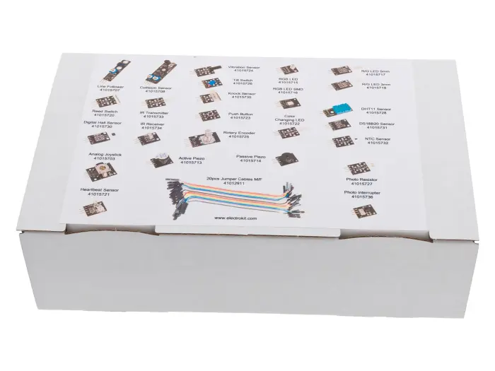
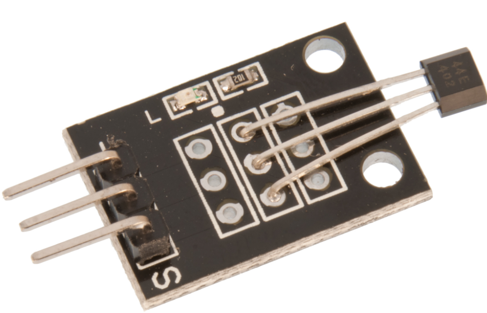
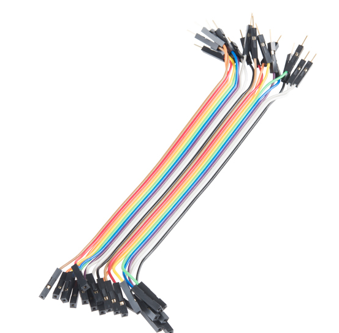
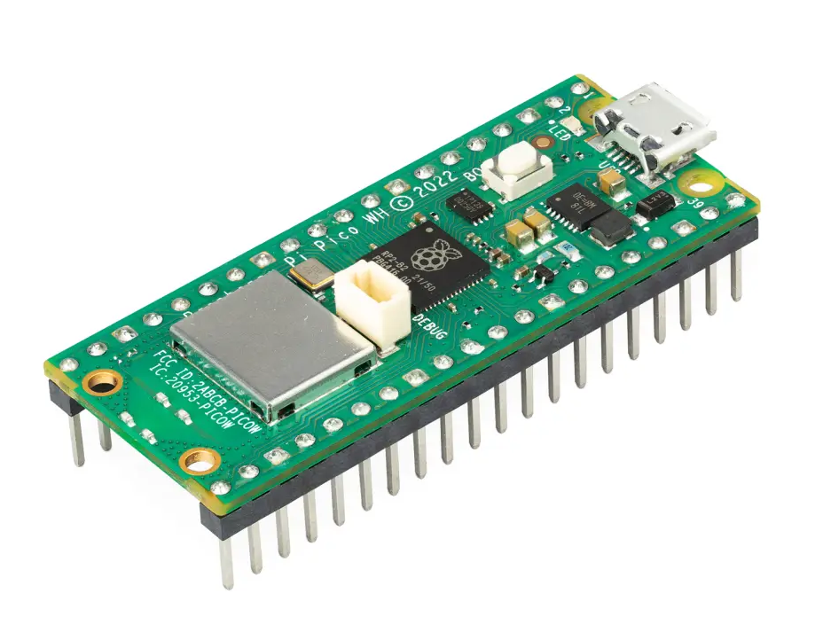
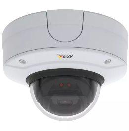
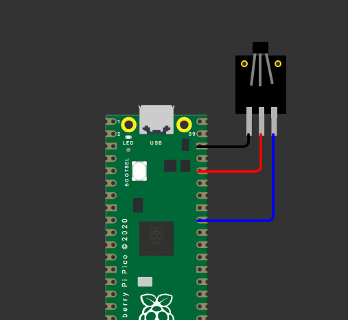
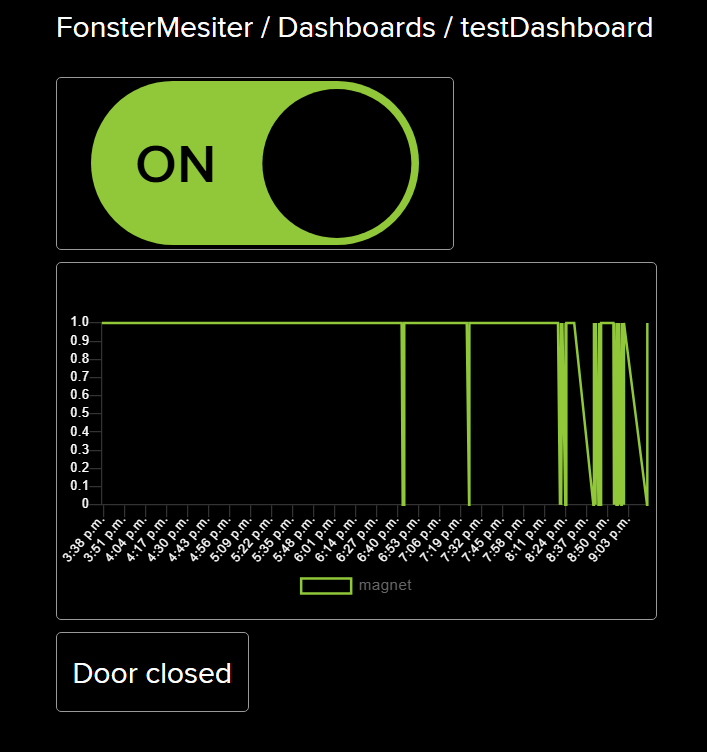
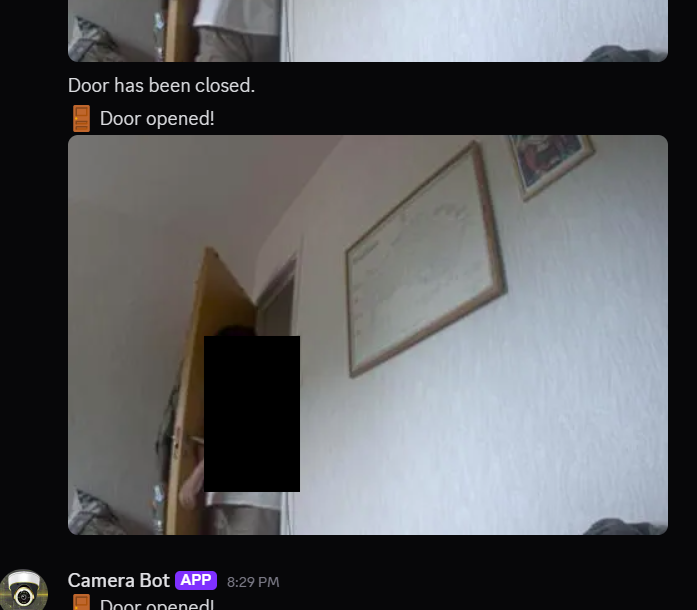
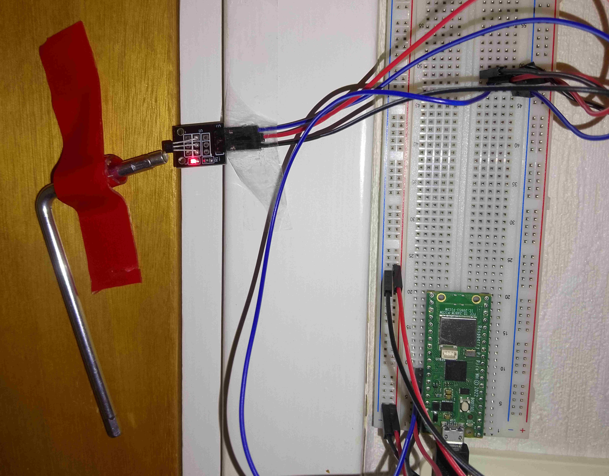

# Door monitoring system

Elias Glas (eg223ua)

## Introduction

This project aims to enhance home security by notifying the resident with an image whenever the door is opened. This is done by utilizing a **Hall effect sensor**, a **magnet**, a **Raspberry Pi Pico W**, a **computer** acting as a server and an **AXIS Q3527 Fixed Dome Network Camera**. When the door is opened, a message and image are sent to a **Discord server** via a **webhook**, and door activity data is stored on **Adafruit IO**. The estimated development time for this project ranges from a few days to a week, depending on prior experience.

## Objective

This project was chosen to create a safer home environment by tracking the activity of the primary point of entry. By capturing pictures at the point of entry or exit and notifying the resident, even while away, it offers peace of mind and awareness of home access.

Additonally the pictures captured could provide in emergency situations, assisting in evacuation tracking and identifying unauthorized access.

The data would show the activity of the monitored door and the pictures would help identify who has entered or exited. This would give valuable insights on which people often come to visit and how long they stay furthermore the data about the door's activity would provide insights probably correlating to the amount of people currently inside, likely increasing at gatherings.

## Material


#### Items purchased
| Item                | Price (SEK) | Purchased from                                                   | Image                                                                                                |
| ------------------- | ----------- | ---------------------------------------------------------------- | ---------------------------------------------------------------------------------------------------- |
| LNU Startkit (2025) | 349         | [electro:kit](https://www.electrokit.com/lnu-starter)            |  |
| Sensor Kit          | 299         | [electro:kit](https://www.electrokit.com/sensor-kit-25-moduler)  |          |


#### Components used
| Component                     | Purpose                                                                     | Image                                                                                      |
| ----------------------------- | --------------------------------------------------------------------------- | ------------------------------------------------------------------------------------------ |
| Hall effect sensor digital    | Detects door opening and closing                                            |    |
| Magnet Neo35 Ø5mm x 5mm       | Enables hall effect sensor to detect door activity                          |    |
| Jumper wires male-female  (3) | Provide electricity and collect data from hall effect sensor                |  |
| Raspberry Pi Pico WH          | Handle sensor triggers and communicate between server, discord and Adafruit |    | 
| Axis Q3527                    | Capture picture at moment of entry/exit                                     |      |

## Computer setup


#### For this project Thonny IDE was chosen to run on the Pico due to the following reasons:
* Beginner friendly
* Built in MicroPython support
* Interaction with the Raspberry Pi Pico WH

#### To start using the Pico, firmware needs to be installed:
1. Download the latest [firmware](https://micropython.org/download/RPI_PICO_W/) for your microcontroller
2. Hold the BOOTSEL button on the Pico before connecting it to your computer
3. Move the firmware to the Pico

#### To start coding using Thonny, follow these steps:
1. [Install Thonny IDE](https://thonny.org/)
2. Connect the Raspberry Pi Pico WH to the device running Thonny with a USB
3. In Thonny select **Run > Configure interpreter > Interpreter**
4. Select MicroPython (Raspberry Pi Pico)
5. Press OK

#### Futhermore Visual Studio Code was used to run the flask server:
1. Download the IDE from its website or the Microsoft Store
2. In Visual Studio Code, go to extensions and download Python
3. If you are missing any modules, open the command prompt and type "pip install {module}"

## Putting everything together

Make use of this [diagram](https://datasheets.raspberrypi.com/picow/PicoW-A4-Pinout.pdf) while connecting your components to the Pico. Connect **GND** pin to the negative **(-)** terminal on the hall effect sensor. Connect the **3V3(OUT)** pin to the middle pin of the sensor. Finally connect the **GPIO** pin to the signal **(S)** pin on the sensor. Electro:kit also provides a useful [diagram](https://www.electrokit.com/upload/product/41015/41015730/41015730_-_Digital_Halleffect_Sensor.pdf). 

#### Circuit diagram


## Platform

Adafruit IO was chosen due to its ease of use and useful tools for showcasing data. Since the information gathered by this IoT system might be of interest all the people living in a residence, a discord server was chosen to host the notifications. Additonally the tools offered by Adafruit made this a simple integration, using discord webhooks.

## The code

#### `keys.py`

`keys.py` contains all the personal information.
```python=
import ubinascii              # Conversions between binary data and various encodings
import machine                # To Generate a unique id from processor

# Wireless network
WIFI_SSID =  "Your SSID"
WIFI_PASS = "Your password"

# Adafruit IO (AIO) configuration
AIO_SERVER = "io.adafruit.com"
AIO_PORT = 1883
AIO_USER = "username"
AIO_KEY = "adafruit key"
AIO_CLIENT_ID = ubinascii.hexlify(machine.unique_id())  # Can be anything
AIO_LIGHTS_FEED = "{username}/feeds/lights"
AIO_MAGNET_FEED = "{username}/feeds/magnet"
AIO_CAMERA_FEED = "{username}/feeds/picture"
```
#### `wifiConnections.py`
This code contains two functions. `connect()` ensures you to the wifi according the information provided in `keys.py` and prints "connecting to network..." and continuosly prints another dot each second until the connection has been established. `disconnect()` disconnects the Pico from the wifi.
```python=
import keys
import network
from time import sleep

def connect():
    wlan = network.WLAN(network.STA_IF)         # Put modem on Station mode
    if not wlan.isconnected():                  # Check if already connected
        print('connecting to network...')
        wlan.active(True)                       # Activate network interface
        # set power mode to get WiFi power-saving off (if needed)
        wlan.config(pm = 0xa11140)
        wlan.connect(keys.WIFI_SSID, keys.WIFI_PASS)  # Your WiFi Credential
        print('Waiting for connection...', end='')
        # Check if it is connected otherwise wait
        while not wlan.isconnected() and wlan.status() >= 0:
            print('.', end='')
            sleep(1)
    # Print the IP assigned by router
    ip = wlan.ifconfig()[0]
    print('\nConnected on {}'.format(ip))
    return ip

def disconnect():
    wlan = network.WLAN(network.STA_IF)         # Put modem on Station mode
    wlan.disconnect()
    wlan = None 
```

#### `main.py`
This file contain several functions. `get_value()` provides the data the sensor is detecting which is either a 1 if the door is open or 0 if it is closed. `send_trigger()` sends a trigger to the server to fetch the image from the camera and publish it to the discord server. `send_value` handles the data gained from the sensor and if the state of the door has changed, the data is published to Adafruit, and if the door is open, `send_trigger()` is called. The main function continuosly loops `send_value()`.
```python=
import time                   # Allows use of time.sleep() for delays
from mqtt import MQTTClient   # For use of MQTT protocol to talk to Adafruit IO
import machine                # Interfaces with hardware components
import micropython            # Needed to run any MicroPython code
from machine import Pin       # Define pin
import keys                   # Contain all keys used here
import wifiConnection         # Contains functions to connect/disconnect from WiFi
import urequests
import json

# BEGIN SETTINGS
# These need to be change to suit your environment
MEASURE_INTERVAL = 5000    # milliseconds
last_value_sent_ticks = 0  # milliseconds
led = Pin("LED", Pin.OUT)   # led pin initialization for Raspberry Pi Pico W
last_read_value = -1

pin_input = Pin(27, Pin.IN)

# IP of the device running the Flask server
SERVER_IP = 'x.x.x.x'  # Replace with your device's IP address
SERVER_PORT = 5000
ENDPOINT = f"http://{SERVER_IP}:{SERVER_PORT}/door"

# Callback Function to respond to messages from Adafruit IO
def sub_cb(topic, msg):          # sub_cb means "callback subroutine"
    print((topic, msg))          # Outputs the message that was received. Debugging use.
    if msg == b"ON":             # If message says "ON" ...
        led.on()                 # ... then LED on
    elif msg == b"OFF":          # If message says "OFF" ...
        led.off()                # ... then LED off
    else:                        # If any other message is received ...
        print("Unknown message") # ... do nothing but output that it happened.

def get_value():
    return pin_input.value()

def send_trigger():
    try:
        print("Sending trigger to server...")
        res = urequests.post(ENDPOINT, json={"status": "open"})
        print("Server response:", res.text)
        res.close()
    except Exception as e:
        print("Error sending trigger:", e)

# Function to publish sensor data to Adafruit IO MQTT server at fixed interval
def send_value():
    global last_value_sent_ticks
    global MEASURE_INTERVAL
    global last_read_value

    if ((time.ticks_ms() - last_value_sent_ticks) < MEASURE_INTERVAL):
        return; # Too soon since last one sent.

    door_status = get_value()
    if last_read_value != door_status:
        last_read_value = door_status
        print("Publishing: {0} to {1} ... ".format(door_status, keys.AIO_MAGNET_FEED), end='')
        try:
            client.publish(topic=keys.AIO_MAGNET_FEED, msg=str(door_status))
            print("DONE")
        except Exception as e:
            print("FAILED")
        finally:
            last_value_sent_ticks = time.ticks_ms()
        if door_status == 1:
            send_trigger()

# Try WiFi Connection
try:
    ip = wifiConnection.connect()
except KeyboardInterrupt:
    print("Keyboard interrupt")

# Use the MQTT protocol to connect to Adafruit IO
client = MQTTClient(keys.AIO_CLIENT_ID, keys.AIO_SERVER, keys.AIO_PORT, keys.AIO_USER, keys.AIO_KEY)

# Subscribed messages will be delivered to this callback
client.set_callback(sub_cb)
client.connect()
client.subscribe(keys.AIO_LIGHTS_FEED)
print("Connected to %s, subscribed to %s topic" % (keys.AIO_SERVER, keys.AIO_LIGHTS_FEED))

try:                      # Code between try: and finally: may cause an error
                          # so ensure the client disconnects the server if
                          # that happens.
    while 1:              # Repeat this loop forever
        client.check_msg()# Action a message if one is received. Non-blocking.
        send_value()     # Send a 0 or 1 depending on door status to Adafruit IO if it's time.
finally:                  # If an exception is thrown ...
    client.disconnect()   # ... disconnect the client and clean up.
    client = None
    wifiConnection.disconnect()
    print("Disconnected from Adafruit IO.")
```
These python files should be on your Raspberry Pi Pico. Additonally this [file](https://github.com/iot-lnu/pico-w/blob/main/network-examples/N2_WiFi_MQTT_Webhook_Adafruit/lib/mqtt.py) is needed for communication with Adafruit IO.

#### `server.py`
This code should run on the device you want to host your server on. It is running a server which upon being triggered by the Pico, gets the picture from the camera and posts it to the discord server.

```python=
from flask import Flask, request
import requests
from requests.auth import HTTPDigestAuth
import datetime
import time

app = Flask(__name__)

# Camera config
CAMERA_USER = "root" #Replace if you have changed username
CAMERA_PASS = "password" #Replace with your password for the camera
IP_CAMERA_URL = "http://x.x.x.x/axis-cgi/jpg/image.cgi" #Replace with the ip address of the camera

# Discord webhook
DISCORD_WEBHOOK_URL = "Your discord webhook"

@app.route('/door', methods=['POST'])
def door_opened():
    print("Door trigger received!")
    time.sleep(2)  # Optional: allow camera to stabilize

    timestamp = datetime.datetime.now().strftime("%Y%m%d_%H%M%S")

    try:
        image_response = requests.get(
            IP_CAMERA_URL,
            auth=HTTPDigestAuth(CAMERA_USER, CAMERA_PASS)
        )

        if image_response.status_code != 200:
            print(f"Camera response: {image_response.status_code}")
            return {"error": "Failed to fetch image"}, 500

        files = {
            "file": (f"snapshot_{timestamp}.jpg", image_response.content)
        }

        data = {"content": "🚪 Door opened!"}
        requests.post(DISCORD_WEBHOOK_URL, data=data, files=files)

        return {"status": "ok"}

    except Exception as e:
        print("Exception:", e)
        return {"error": "Exception during image fetch"}, 500

if __name__ == '__main__':
    app.run(host='0.0.0.0', port=5000)
```

## Transmitting the data / connectivity

#### Frequency of data being sent
Data is transmitted only at moments of change; when the system is first activated and then whenever the state of door changes, either from beings closed to opened or vice versa. To reduce faulty readings and avoid overloading and prevents exceeding upload limits on Adafruit IO and Discord.

#### Wireless protocols
The Raspberry Pi Pico WH utilizes WiFi to communicate. It communicates with:
* Adafurit IO via the MQTT protocol
* A local flask server over HTTP

The Flask server, also running on a device that utilizes WiFi, communicates with:
* The Axis camera via HTTP requests
* The Discord server through webhooks

## Presenting the data
The data is visualized on Adafruit using a graph showing at which points the door has been open or closed. Adafruit stores data of the feed for 30 days. 



Additonally another way the status of the door has been visualized is the picture sent to discord and the messages of whether the door is open or closed. Messages on discord are kept indefinietly or until discord is discontinued. Adafruit was chosen as a way to display the activity of the door, and extending the period the data was kept could have enabled for better visualization, but the main focus was on the picture of the door opening, which is kept indefinietly and shared with everyone that is a member of the discord server.



The data, as previously discussed, is sent whenever the state of the door changes, with a 5 second interval between measurements.

## Finalizing the design

I definietly would have liked to contain the electronics more neatly, but due to time constraintments, that wassn't achieved. 



A more advanced system would have sent videos a few seconds after the door opening or until the door closed to account for more than one or a few people entering or exiting the door. Additonally some sort of motion sensor could have been used as a solution to the cases where the door is just left open for a while. Despite the many improvements that could have been made, I still think the project went well and achieved what I set out to do.

#### Video of my project
[](https://www.youtube.com/watch?v=Q4C09NGN4Ss)
